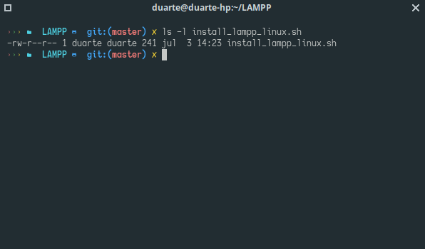
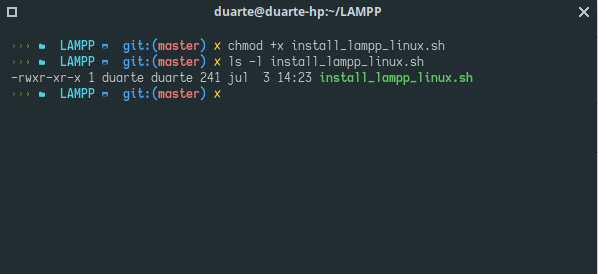

## Welcome to my repository to ease LAMPP installation for novice users or to save labor
[To go to the Spanish version click here](https://github.com/Du-F23/install_lampp_linux/blob/master/REAME.ES.MD)
To install we will execute the file install_lampp_linux.sh.\
To execute it is very simple, we verify if you have execution permissions.\
We will use the following command
ls -l install_lampp.sh
\

\
After that we execute the following command
chmod +x install_lampp_linux.sh
\
To check if it was done we apply the previous command
ls -l install_lampp.sh
\

\
