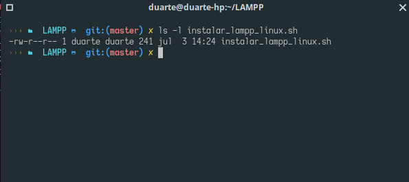

## Bienvenido a mi repositorio para facilitar la instalación de LAMPP para usuarios novatos o para ahorrar trabajo
[Para ir a la version en ingles](https://github.com/Du-F23/install_lampp_linux/)
Para instalar ejecutaremos el archivo instalar_lampp_linux.sh.\
Para ejecutarlo es muy sencillo
Entramos a la carpeta donde se guardo
cd LAMPP
Verificamos si tiene permisos de ejecución.\
Usaremos el siguiente comando 
ls -l install_lampp_linux.sh 
\

\
Posterior a eso ejecutamos el siguiente comando
chmod +x instalar_lampp_linux.sh
\
Para checar si se realizo aplicamos el comando anterior
ls -l install_lampp.sh
\

\
